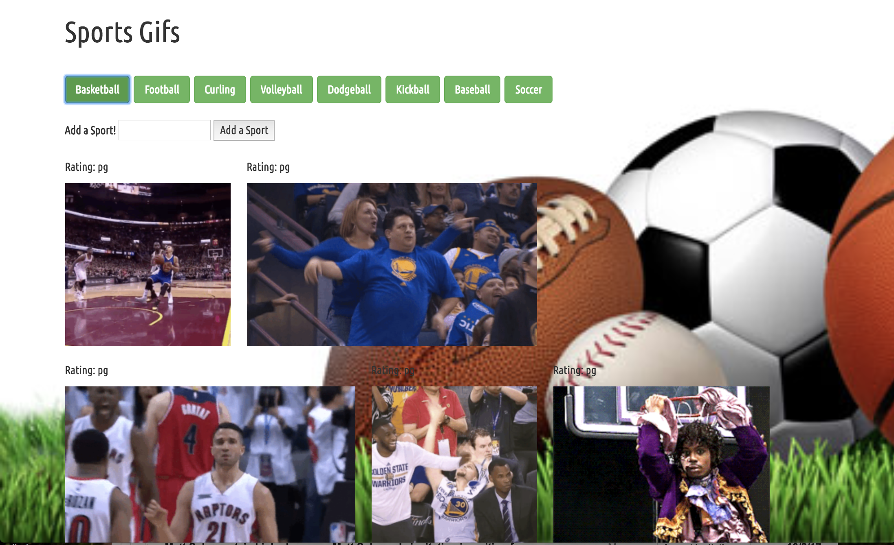

# GIFtastic

Link to app: https://bayjosh.github.io/GIFtastic/

Screenshot can be found here: 

This app allows users to view a selection of sports GIFs by clicking pre-selected buttons, or by adding their own. Users can set the gifs in motion by clicking on them individually, and pause them by clicking again. Each button creates a search in Giphy's database using Giphy's API for on-theme images and presents them on the screen. 

Technologies used: 
Giphy API
Javascript/jQuery
Bootstrap framework for styling
CSS for styling